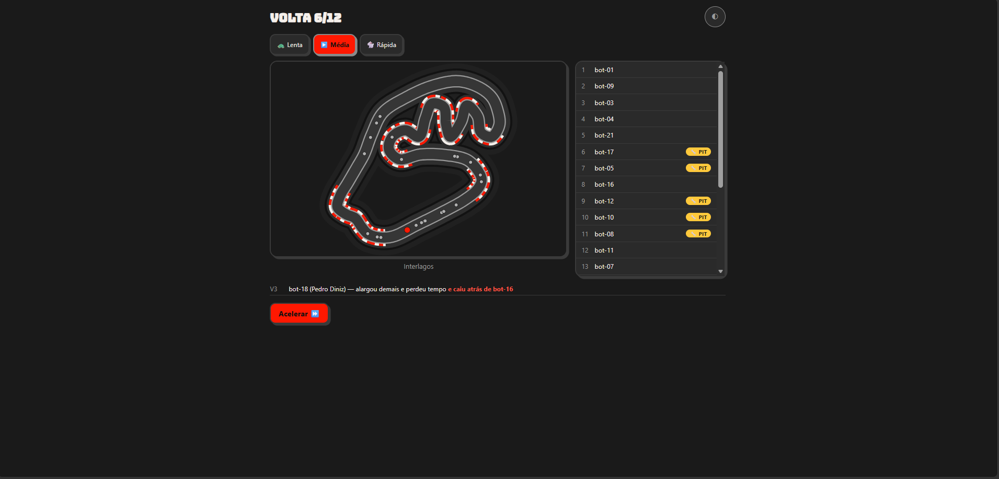
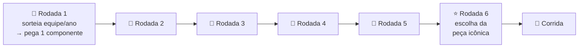
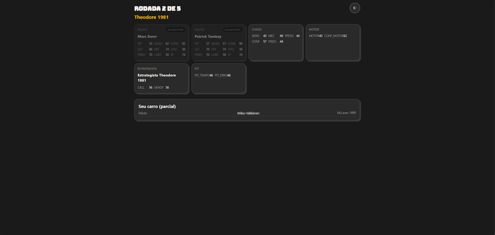
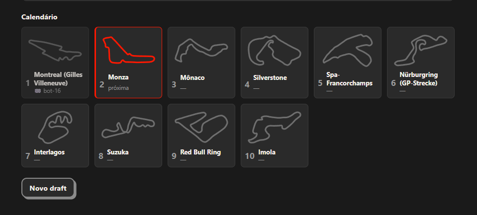
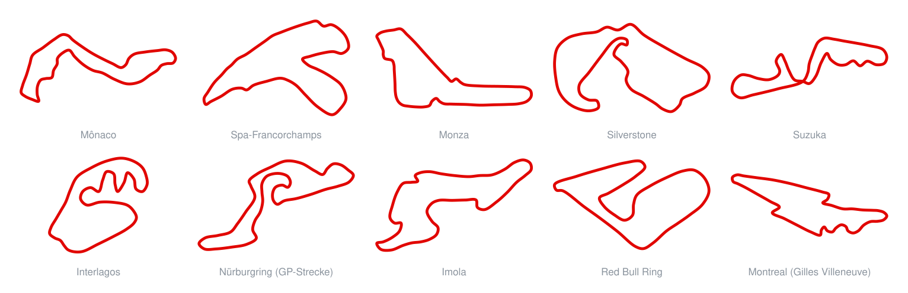

<div align="center">

# 🏎️ F1 Fantasy

**Monte um carro frankenstein com peças de 76 anos de Fórmula 1 e corra contra 21 rivais.**

[](https://www.typescriptlang.org/)
[](https://react.dev/)
[](https://vite.dev/)
[](https://vitest.dev/)
[](#-como-rodar)
[](#-destaques-t%C3%A9cnicos)
[](LICENSE)

> ⚠️ **Projeto de fã, não oficial.** Sem qualquer afiliação, patrocínio ou endosso da Formula 1,
> da FIA ou de qualquer equipe. Nomes de pilotos, equipes e circuitos aparecem apenas como
> referência factual a eventos históricos públicos.

</div>

<div align="center">
  
</div>

---

## 🎮 O que é

F1 Fantasy é um jogo de navegador de **draft e simulação de Fórmula 1**, inspirado nos jogos virais
brasileiros **"7x1"** e **"38 a 0"** — aquela mesma fórmula de sortear, montar e ver no que dá,
com uma partida inteira cabendo num intervalo de almoço.

A ideia é simples e cruel: você não escolhe um carro pronto. Você monta um **frankenstein**.
Sorteia uma equipe e um ano — digamos, Ferrari 2004 — e leva **um único componente** dela. Depois
sorteia de novo, e de novo. No fim você tem um piloto de uma era, um chassi de outra, um motor de
uma terceira, e uma equipe de pit stop que talvez nem existisse quando esse piloto correu. São
**76 temporadas (1950–2025)** e **771 combinações de equipe/ano** no baralho.

Aí o carro vai pra pista contra **21 rivais** que passaram exatamente pelo mesmo processo. Quali,
largada, ritmo, estratégia de parada, incidentes — tudo simulado volta a volta, e tudo derivado de
uma **seed**. A mesma seed devolve a mesma corrida, bit a bit, sempre.

---

## 🎲 Como funciona

### O draft: 6 rodadas



Nas **rodadas 1 a 5**, cada jogador recebe um sorteio de equipe/ano e escolhe **um** dos cinco
slots pra preencher com aquela combinação. O que não for pego, se perde:

| Slot                | O que representa                              |
| ------------------- | --------------------------------------------- |
| 🧑‍✈️ **Piloto**       | A dupla de pilotos daquela equipe naquele ano |
| 🏗️ **Chassi**       | O carro, aerodinâmica e comportamento         |
| ⚙️ **Motor**        | A unidade de potência                         |
| 🧠 **Estrategista** | O muro dos boxes — chamadas de parada         |
| 🔧 **Pit**          | A velocidade e a confiabilidade da troca      |

Como só há 5 rodadas para 5 slots, cada sorteio é uma decisão real: aceitar um motor mediano agora
ou torcer por algo melhor e ficar sem opção depois.

Na **rodada 6** vem a **peça icônica** — uma carta de um catálogo de **24 peças** que modifica o
carro montado. É o único momento de escolha aberta do draft.

<div align="center">
  
</div>

_Rodada 2 de 5: saiu **Theodore 1981**. O piloto já foi preenchido em outra rodada, então sobram
chassi, motor, estrategista e pit — e só um deles vai levar essa equipe. No Modo Craque, as notas
aparecem; no Cego, não._

### Os modos

| Modo          | Como é                                                                 |
| ------------- | ---------------------------------------------------------------------- |
| 👤 **Single** | Você + 21 bots                                                         |
| 👥 **Local**  | 2 a 4 jogadores humanos no mesmo dispositivo + bots completando o grid |

| Formato                      | Etapas                           |
| ---------------------------- | -------------------------------- |
| 🏁 **Corrida única**         | 1 corrida, resultado na hora     |
| 🏆 **Campeonato curto**      | 5 pistas, com tabela acumulada   |
| 🏆🏆 **Campeonato completo** | 10 pistas — o calendário inteiro |

No campeonato, o calendário é sorteado, cada etapa mostra a miniatura do traçado e a tabela
acumula entre as corridas — com a variação de posição de cada jogador etapa a etapa.

<div align="center">
  
</div>

### Visibilidade: Craque ou Cego

| Modo          | O que você vê                                                                                      |
| ------------- | -------------------------------------------------------------------------------------------------- |
| 👁️ **Craque** | As notas dos componentes e das peças ficam visíveis. Draft de leitura e cálculo.                   |
| 🎲 **Cego**   | As notas dos componentes e das peças ficam escondidas — sobra o nome, o ano e a sua memória de F1. |

O Modo Cego esconde as notas; não esconde a pista nem o resultado da corrida. É a diferença entre
otimizar uma planilha e apostar no que você acha que sabe sobre a McLaren de 1988.

---

## 🔬 Destaques técnicos

Esta é a parte de que o projeto se orgulha.

### 🎯 Simulação 100% determinística

**Nenhum `Math.random()` em lugar nenhum da engine** — é regra arquitetural, não boa intenção. Toda
aleatoriedade sai de um RNG semeado explicitamente. Mesma seed + mesmos loadouts ⇒ **mesma corrida,
bit a bit**, em qualquer máquina.

Isso não é purismo: é o que torna o multiplayer online viável com um servidor magro (a corrida roda
no cliente, o servidor só coordena a seed), é o que permite reproduzir um bug a partir de um número,
e é o que sustenta a ideia de um "Desafio do Dia" com a mesma corrida pra todo mundo.

### 📊 Dataset derivado de fatos, não digitado à mão

As **771 combinações de equipe/ano (1950–2025)** não foram estimadas por opinião. Elas são
**derivadas de resultados históricos reais** puxados da API **Jolpica-F1** (sucessora da Ergast) e
processadas por um pipeline versionado:

```
dataset:fetch  →  dataset:fatos  →  dataset:notas  →  dataset:report
  (API pública)   (agrega fatos)   (deriva notas)    (relatório)
```

A normalização é o detalhe que faz a coisa funcionar: cada nota vem do **percentil de Hazen dentro
da própria temporada**, mapeado pra uma faixa-alvo. Ou seja — um carro é medido contra os
adversários que ele realmente enfrentou, não contra a história inteira. Sem isso, a era híbrida
esmagaria os anos 50 por puro avanço tecnológico e o draft perderia a graça.

### ⚖️ Balanceamento medido, não sentido

O projeto tem um **balance harness** próprio (`npm run balance`), rodado fora da suíte normal
porque é pesado. Ele simula em massa e mede:

| Métrica                                                                            | Amostra         |
| ---------------------------------------------------------------------------------- | --------------- |
| **Dominância por década** — nenhuma era pode ser o "botão de vencer"               | 200 campeonatos |
| **Raridade de peça** — com que frequência cada peça icônica aparece                | 200 campeonatos |
| **Taxa de vitória do pole** — a corrida tem que ser decidida no ritmo, não no grid | 400 seeds       |
| **Paradas extras** — incidência de estratégia alternativa                          | 300 seeds       |

Regra do projeto: mudou nota, fórmula ou balanceamento, roda o harness antes de considerar pronto.

### 🧱 Engine e UI separadas de verdade

```
src/engine/   TypeScript puro — draft, notas, quali, corrida, campeonato, RNG.
              NUNCA importa React nem nada de UI. Funções puras: entram dados
              + seed, sai resultado. Sem estado global, sem I/O.
src/ui/       React. Consome a engine, jamais reimplementa regra de jogo.
src/data/     JSON puro: equipe/anos, pistas, peças. Sem lógica.
src/net/      Camada de rede (planejada) — isola o online do resto.
```

A engine roda em Node sem navegador nenhum. É por isso que o harness consegue simular centenas de
campeonatos num teste.

### 🗺️ 10 pistas com silhueta própria

<div align="center">
  
</div>

Cada traçado é desenhado em SVG a partir de dados de curvatura, com asfalto, limites e zebras
gerados por geometria — **não são imagens de terceiros nem contornos copiados**. Passaram por
**teste cego de reconhecimento: 10/10** (contra linha de base 0/10 antes do redesenho).

A grade acima não é um print: é gerada a partir da **mesma função de geometria que a tela de
corrida usa** (`pathDaVolta`), por `npm run preview` — se o traçado mudar no jogo, muda aqui
também. Regerar é um comando, não um trabalho de captura.

### ✅ 1094 testes

Em 36 arquivos, cobrindo engine e UI. Mudança de lógica de simulação neste projeto começa por um
**teste que falha** capturando o comportamento pretendido — só depois vem a implementação.

---

## 🚀 Como rodar

Precisa de **Node LTS**.

```bash
npm install
npm run dev      # http://localhost:5173
```

### Scripts

| Comando              | O que faz                                                                                                               |
| -------------------- | ----------------------------------------------------------------------------------------------------------------------- |
| `npm run dev`        | Sobe o servidor de desenvolvimento (Vite)                                                                               |
| `npm test`           | Roda a suíte completa (1094 testes)                                                                                     |
| `npm run test:watch` | Testes em modo watch                                                                                                    |
| `npm run build`      | `tsc --noEmit` + build de produção                                                                                      |
| `npm run typecheck`  | Só a checagem de tipos                                                                                                  |
| `npm run lint`       | ESLint                                                                                                                  |
| `npm run format`     | Prettier                                                                                                                |
| `npm run balance`    | Balance harness — pesado, roda fora do `npm test`                                                                       |
| `npm run preview`    | Gera os previews visuais em `preview/` (gitignored) **e** a grade de silhuetas em `docs/img/silhuetas.svg` (versionada) |

### Pipeline de dados

Só é necessário pra **regerar** o dataset — o resultado já está versionado em `src/data/`.

| Comando                  | O que faz                             |
| ------------------------ | ------------------------------------- |
| `npm run dataset:fetch`  | Baixa os fatos crus da API Jolpica-F1 |
| `npm run dataset:fatos`  | Agrega os fatos por equipe/ano        |
| `npm run dataset:notas`  | Deriva as notas por percentil         |
| `npm run dataset:report` | Relatório do dataset gerado           |

---

## 🛠️ Stack

| Camada               | Tecnologia                                            |
| -------------------- | ----------------------------------------------------- |
| Engine               | **TypeScript** puro, sem dependência de UI            |
| Front-end            | **React 19** + **Vite 7** + SVG                       |
| Testes               | **Vitest 4**                                          |
| Online _(planejado)_ | **PartyKit** — Durable Objects na borda da Cloudflare |

No modelo online planejado, a corrida roda no cliente e o servidor só coordena — o determinismo por
seed é justamente o que permite esse desenho.

---

## 📜 Créditos e avisos

### Fonte dos dados

Os fatos históricos que alimentam o dataset vêm da **[API Jolpica-F1](https://api.jolpi.ca/ergast/f1/)**,
sucessora da [Ergast Developer API](https://ergast.com/mrd/). Agradecimento sincero a quem mantém
esse serviço público — sem ele este projeto não existiria na forma em que está.

Os dados usados são **fatos históricos públicos** (resultados, posições, participações). O projeto
não reivindica direito algum sobre nomes de pilotos, equipes, motores ou circuitos: eles aparecem
como referência factual a eventos que aconteceram, e as marcas pertencem a seus respectivos
titulares.

### Aviso

> **Este é um projeto de fã, sem fins oficiais.** Não possui qualquer afiliação, patrocínio,
> licenciamento ou endosso da **Formula 1**, da **FIA**, da Formula One World Championship Limited,
> de qualquer equipe, piloto ou fabricante mencionado. _F1_, _FORMULA 1_, _GRAND PRIX_ e marcas
> relacionadas pertencem a seus respectivos titulares. Nenhuma arte, logotipo ou material gráfico de
> terceiros é incorporado ao projeto — os traçados de pista e os elementos visuais são originais.

### Licença

O **código** deste projeto está sob a **[Licença MIT](LICENSE)** — use, modifique e distribua à
vontade, mantendo o aviso de copyright.

A MIT cobre **o que foi escrito aqui**: a engine, a interface, os scripts e os traçados de pista
originais. Ela **não** concede nem reivindica direito algum sobre nomes de pilotos, equipes,
motores, circuitos ou marcas de terceiros que aparecem como referência factual — esses continuam
com seus respectivos titulares, e nada nesta licença muda isso. Os fatos históricos derivados da
API Jolpica-F1 seguem os termos da própria fonte.
